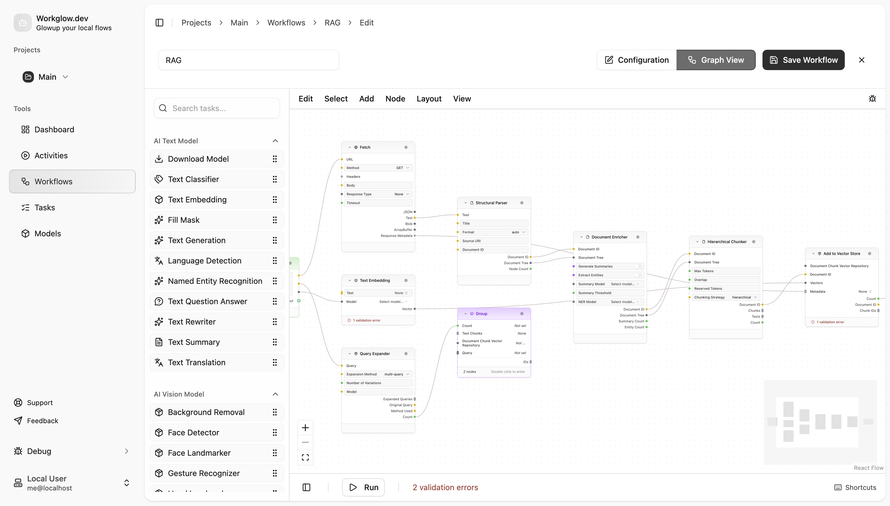

# WORKGLOW

## Overview

Simple library to build linear and graph based workflows. It is designed to be simple to use and easy to extend, yet powerful enough to handle task rate limits, retries, etc.

## Authors

- [Steven Roussey](https://stevenroussey.com)

## Roadmap

- [x] Release 0.1.0: Stable API for task graph, storage, and job queue.\* _31 Mar 2026_
- [ ] Release 0.2.0: Stable text generation, toolcalling, and agent loops.
- [ ] Release 0.3.0: Browser control (direct and mcp).
- [ ] Release 0.4.0: Task Entitlements.
- [ ] Release 0.5.0: User in the loop, wherever they are.
- [ ] Release 0.6.0: Reworked output cache, checkpointing, and resumption.

_\*stable is a relative term, and will be updated at some point as we go before version 1.0.0._

## Docs

- **[Getting Started](docs/developers/01_getting_started.md)**
- **[Architecture](docs/developers/02_architecture.md)**
- **[Extending the System](docs/developers/03_extending.md)**

Packages:

- **[packages/storage](packages/storage/README.md)**
- **[packages/task-graph](packages/task-graph/README.md)**
- **[packages/job-queue](packages/job-queue/README.md)**
- **[packages/tasks](packages/tasks/README.md)**
- **[packages/ai](packages/ai/README.md)**
- **[packages/ai-provider](packages/ai-provider/README.md)**
- **[packages/util](packages/util/README.md)**
- **[packages/test](packages/test/README.md)**

- **[packages/workglow](packages/workglow/README.md)**

## Examples

### CLI

### Web

[Demo](https://workglow-web.netlify.app/)

### Node Editor

[Local Drag and Drop Editor](https://workglow.dev)

