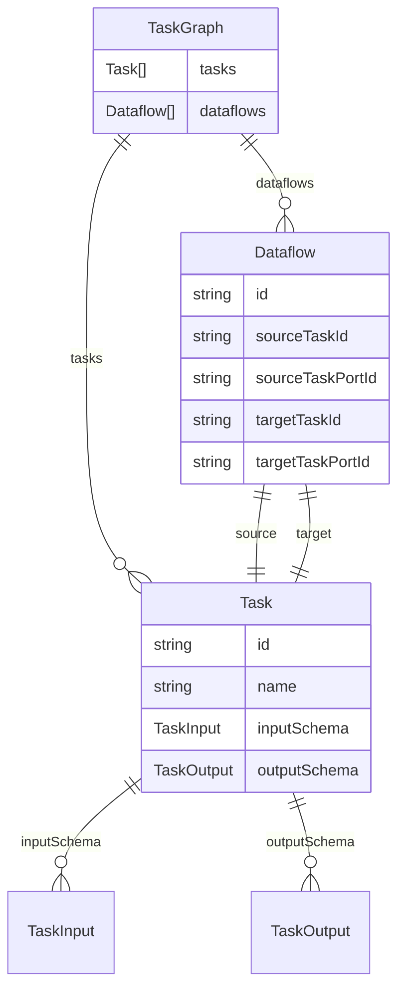

# Run Graph Orchestration

## Introduction

We have Tasks (preprogrammed to do some action), `JobQueueTask` types (these get posted to job queues), and `GraphAsTask` types that contain a whole graph. These are all internal and must be defined in code.

When an end user wants to build a pipeline, they need to be able to define a list of tasks to run. This is where graphs come in. The directed acyclic graph (DAG) is more flexible than simple chains.

The editor DAG is defined by the end user and saved in the database (tasks and dataflows), filesystem, etc.

## Graph

The graph is a DAG. It is a list of tasks and a list of dataflows. The tasks are the nodes and the dataflows are the connections between task outputs and inputs, plus status.

We expose events for graphs, tasks, and dataflows. A suspend/resume could be added for bulk creation. This helps keep a UI in sync as the graph runs.

### Node / Task

- Task

Notes about requirements for the tasks:

- Must have input schema and output schema
- The input/output schema is a runtime JSON schema; TS types are inferred separately where helpful

### Edge / Dataflow

- Dataflow
- Instrumentation

Notes about requirements for the edges:

- Multiple outputs can feed multiple inputs (multiple dataflows can exist between two tasks)

### Graph Runner

`TaskGraphRunner` schedules and executes tasks respecting dependencies. It pushes node outputs to outgoing dataflows and can merge leaf results using a compound strategy.

# User Task Graph

