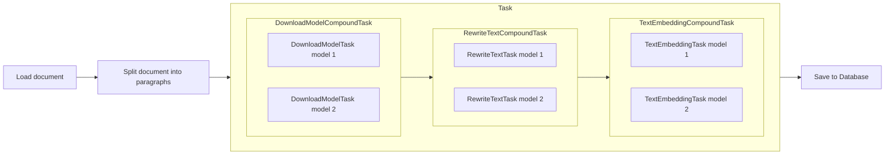
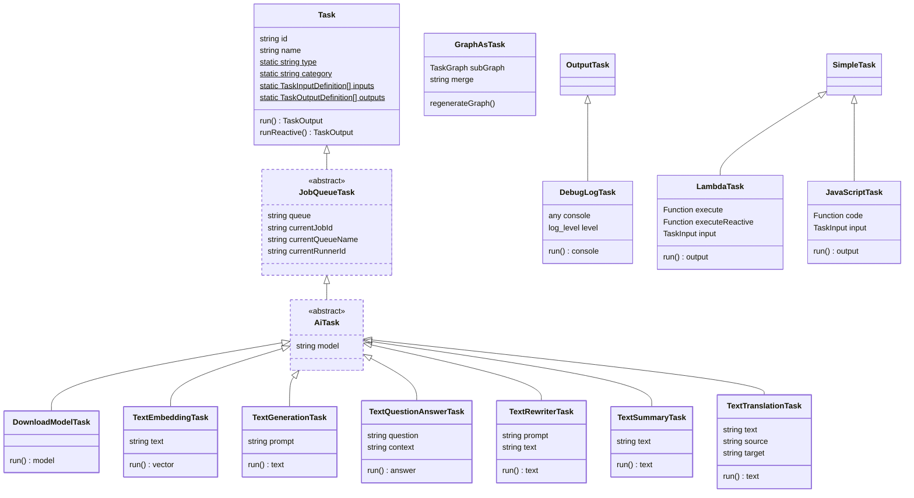
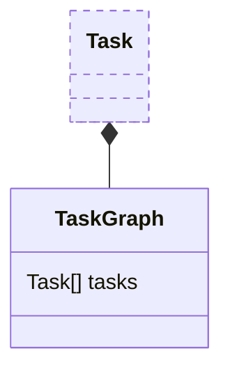
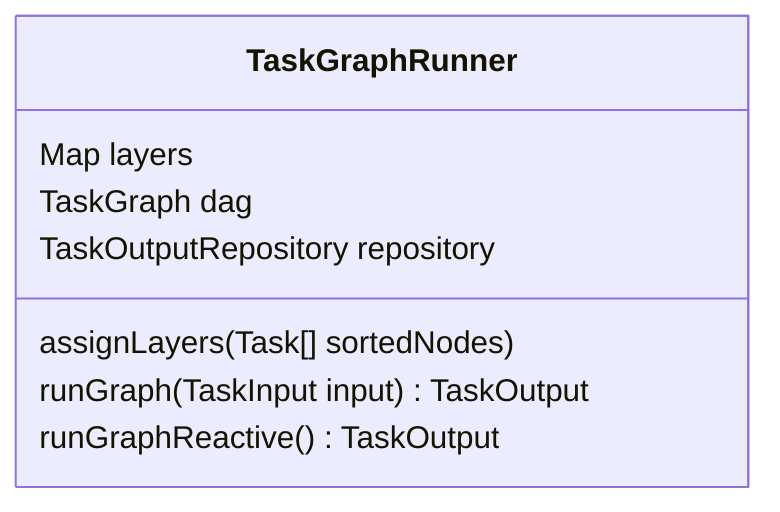
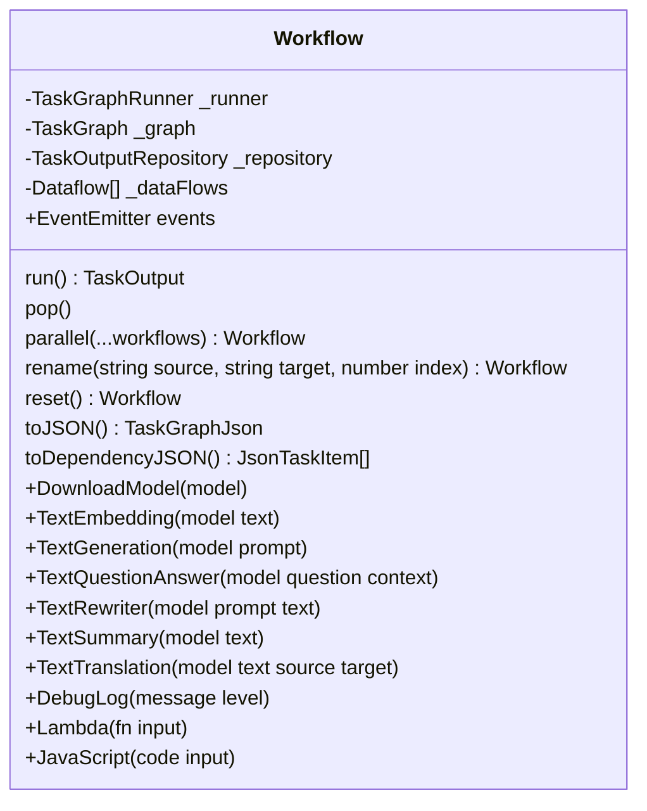

- [Design Principles](#design-principles)
- [Storage](#storage)
- [Source Data](#source-data)
- [LLM Providers](#llm-providers)
- [Job Queue](#job-queue)
- [Tasks](#tasks)
- [Task Classes](#task-classes)
- [TaskGraph](#taskgraph)
- [TaskGraphRunner](#taskgraphrunner)
- [Workflow](#workflow)

# Architecture Documentation

This document covers the architecture and the reasoning behind the design decisions. For a more practical guide to getting started, see the [Developer Getting Started](./01_getting_started.md) guide. After reading this document, read [Extending the System](03_extending.md) to see how to create your own Tasks. And if you want a rambling background on the motivations behind this project, see the [Motivations](../background/01_motivations.md) guide.

## Design Principles

- **Simple to Use**: The system should be simple to use and easy to extend.
- **Orthogonal Systems**: The system should be composed of orthogonal systems that can be easily swapped out. For example, there is an optional caching layer in the task graph runner, which has many different caching system options (in memory, IndexedDB in browser, filesystem, SQLite, Postgres, etc.).
- **Resumable**: The system should be resumable, so that if the user closes the app while processing, they can come back to it later.
- **No-Code/Low-Code**: The system should be able to be used by no-code/low-code users, so tasks enumerate their inputs and outputs explicitly, as well as some other metadata like if it has side effects, its name and category, etc.
- **Code Generation**: Ideally you should be able to back and forth from a task graph to code and back again.
- **Task Graphs**: The system should be based on graphs, where tasks are connected by data flows to form a directed acyclic graph (DAG).

# Overview

The system is composed of several different systems, several of which that can be swapped out for different implementations. These systems are:

## Storage

- **TaskGraphRepository**: The TaskGraphRepository is responsible for storing the task graphs that are waiting to be run. There are implementations for in-memory, IndexedDB in the browser, filesystem, SQLite, Postgres, etc.
- **TaskOutputRepository**: The TaskOutputRepository is responsible for storing the output of tasks. It can be added to a TaskRunner to provide caching of intermediate steps. There are implementations for in-memory, IndexedDB in the browser, filesystem, SQLite, Postgres, etc. You can create your own to, say, only cache the last 10 runs of a task, or cache everything but runs of a task that had a certain input, like a specific model etc.

## Source Data

- **FileSource**: The FileSource is responsible for reading and writing files. There are implementations for reading and writing files to the filesystem.
- **Sqlite**: The Sqlite is responsible for reading and writing Sqlite.
- **Postgres**: The Postgres is responsible for interfacing with Postgres.

## LLM Providers

- **Hugging Face**: The Hugging Face provider is a simple wrapper around the Transformers.js library and is intended for running models locally. This library uses ONNX under the hood, which is optimized for running on the command line, but it also works in the browser using WASM and soon WebGPU.
- **MediaPipe**: The MediaPipe provider is a simple wrapper around the MediaPipe library and is intended for running models locally. This library uses Tensorflow.js under the hood.
- **OpenAI**: The OpenAI provider is a simple wrapper around the OpenAI API and is intended for running models in the cloud.\*
- **Anthropic**: The Anthropic provider is a simple wrapper around the Anthropic API and is intended for running models in the cloud.\*

## Job Queue

Some tasks are run in a queue, so that a full task queue can resume where it left off (in concert with a TaskOutputRepository). Queues handling things like retries, timeouts, and other things that are not directly related to the task itself. There are several storage implementations:

- **InMemoryQueueStorage**: The InMemoryQueueStorage is a simple in-memory queue storage that is not resumable.
- **IndexedDbQueueStorage**: The IndexedDbQueueStorage is a queue storage that is stored in the browser's IndexedDB and is resumable.
- **SqliteQueueStorage**: The SqliteQueueStorage is a queue storage that is stored in a SQLite database and is resumable.
- **PostgresQueueStorage**: The PostgresQueueStorage is a queue storage that is stored in a Postgres database and is resumable.

Queues can have limiters, like only running one task at a time, or based on rate limits.

- **RateLimiter**: The RateLimiter is a rate limiter that can be used to limit the number of tasks that are run in a certain time period. If a task using an API errors out, the rate limiter can use details of the error response to determine how long to wait before trying again. Rate limiters are created by combining the `RateLimiter` class with a storage backend:
  - **SqliteRateLimiterStorage**: Storage backend for rate limiters using a Sqlite database.
  - **PostgresRateLimiterStorage**: Storage backend for rate limiters using a Postgres database.
  - **InMemoryRateLimiterStorage**: Storage backend for rate limiters stored in memory.
  - **IndexedDbRateLimiterStorage**: Storage backend for rate limiters using the browser's IndexedDB.\*
- **ConcurrencyLimiter**: The ConcurrencyLimiter is a simple concurrency limiter that can be used to limit the number of tasks that are run at the same time.
- **CompositeLimiter**: The CompositeLimiter is a simple composite limiter that can be used to combine multiple limiters.

## Tasks

Tasks are the main building blocks of the system. They are simple or compound tasks that are the nodes in a directed acyclic graph (DAG), where the edges are Dataflows.

- **Task** Each task class has well defined inputs and outputs definitions. When a task is created, it can some of its inputs provided (defaults). The remainder of the inputs will come from the outputs of other tasks in the graph. When combined, the data can be found in runInputData at the time the task is run.
- **Dataflow** The tasks in a graph are connected by edges called Dataflows. These define the which task and which output of that task are connected to which input of the next task.

# Tasks

## Task Classes

## TaskGraph

## TaskGraphRunner

The TaskGraphRunner is responsible for executing tasks in a task graph. Key features include:

- **Layer-based Execution**: Tasks are organized into layers based on dependencies, allowing parallel execution of independent tasks
- **Caching Support**: Can use a TaskOutputRepository to cache task outputs and avoid re-running tasks
- **Reactive Mode**: Supports reactive execution where tasks can respond to input changes without full re-execution
- **Smart Task Scheduling**: Automatically determines task execution order based on dependencies

## Workflow

The Workflow provides a fluent interface for constructing task graphs. Key features include:

- **Event System**: Emits events for graph changes and execution status
- **Parallel Execution**: Can run multiple task graphs in parallel
- **Repository Integration**: Optional integration with TaskOutputRepository for caching
- **JSON Support**: Can import/export graphs as JSON
- **Smart Task Connection**: Automatically connects task outputs to inputs based on naming
- **Task Management**: Methods for adding, removing, and modifying tasks in the graph

# Warnings / TODO

-**Items marked with \\\* are not yet implemented.** These are good items for a first-time contributor to work on. ;)

-**Graphs are not yet resumable** While much work has gone into making the system resumable, the TaskRunner has a ways to go before it is fully resumable. This is a major TODO item.
